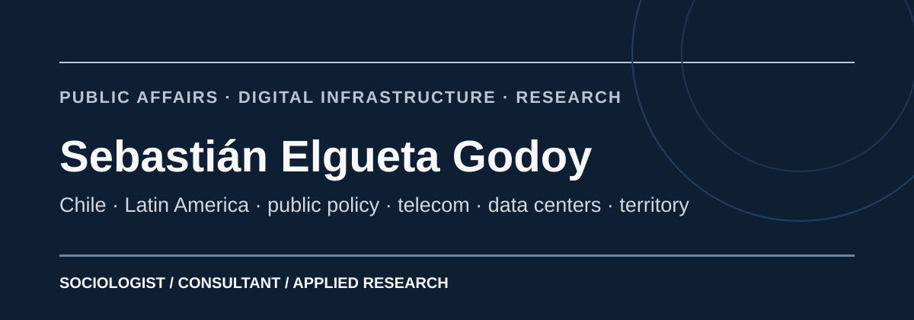

# Sebastián Elgueta Godoy

**Sociólogo · Asuntos públicos · Políticas públicas · Infraestructura digital · Telecomunicaciones · Chile y América Latina**

Trabajo en la intersección entre **regulación, infraestructura, inversión, territorio y datos**. Desarrollo investigación aplicada y asesoría estratégica sobre data centers, telecomunicaciones, conectividad, inclusión digital, institucionalidad y condiciones para el desarrollo de infraestructura.

[**Sitio oficial**](https://selguetagodoy.github.io/) · [**Investigación**](https://selguetagodoy.github.io/investigacion.html) · [**Datos abiertos**](https://selguetagodoy.github.io/datos-abiertos.html) · [**Publicaciones**](https://selguetagodoy.github.io/publicaciones.html) · [**LinkedIn**](https://cl.linkedin.com/in/sebastian-elgueta-godoy) · [**Academia.edu**](https://uai.academia.edu/ElguetaGodoy) · [**ResearchGate**](https://www.researchgate.net/profile/Sebastian-Elgueta-Godoy)

### Referencias externas verificadas

- **COTEL · Atlas de la Desconexión Digital:** [agenda oficial del Congreso COTEL 2026](https://cotel.cl/congreso/agenda/) · [nota de autoría](https://cotel.cl/la-nueva-brecha-digital-combina-uso-dispositivos-y-presupuesto/) · [ficha del Atlas](https://selguetagodoy.github.io/atlas-desconexion-digital-chile.html)
- **CIPER · Telecomunicaciones:** [El próximo paso del 5G](https://www.ciperchile.cl/2026/07/10/el-proximo-paso-del-5g/)
- **Identidad y referencias públicas:** [Sebastián Elgueta Godoy en la web](https://selguetagodoy.github.io/en-la-web.html)

---

## Data centers · Chile 2026

**[Data Centers en Chile 2026](https://selguetagodoy.github.io/data-centers-chile-2026.html)** — radiografía de capacidad, inventario comercial, pipeline y energía con boundaries explícitos y fuentes públicas.

[Benchmark internacional · 10 hubs](https://selguetagodoy.github.io/benchmark-data-centers-2026.html) · [Infraestructura digital](https://selguetagodoy.github.io/infraestructura-digital.html) · [Latin America Digital Infrastructure](https://selguetagodoy.github.io/dataset-latin-america-digital-infrastructure.html)

---

## Investigación y datasets

| Proyecto | Qué estudia | Versión citable |
|---|---|---|
| **[Latin America Digital Infrastructure](https://selguetagodoy.github.io/dataset-latin-america-digital-infrastructure.html)** | Data centers, cloud, IXPs, energía e institucionalidad en ocho mercados latinoamericanos | [DOI 10.5281/zenodo.22921175](https://doi.org/10.5281/zenodo.22921175) |
| **[Chile Digital Inclusion](https://selguetagodoy.github.io/dataset-chile-digital-inclusion.html)** | Inclusión digital, conectividad, redes e inequidades territoriales en 346 comunas | [DOI 10.5281/zenodo.22921191](https://doi.org/10.5281/zenodo.22921191) |
| **[Atlas de la Desconexión Digital de Chile](https://selguetagodoy.github.io/atlas-desconexion-digital-chile.html)** | Intensidad y escala territorial de la brecha digital; fragilidad y vulnerabilidad digital | [DOI 10.5281/zenodo.22921209](https://doi.org/10.5281/zenodo.22921209) |
| **[Velocidades de Internet](https://selguetagodoy.github.io/dataset-velocidades-internet.html)** | Series Akamai y Ookla 2008–2026 para Chile, Colombia y comparadores | [DOI 10.5281/zenodo.22921203](https://doi.org/10.5281/zenodo.22921203) |
| **[Chile State Institutional Map](https://selguetagodoy.github.io/dataset-chile-state-institutional-map.html)** | Estructura del Estado chileno para asuntos públicos, regulación y stakeholder mapping | [DOI 10.5281/zenodo.22921221](https://doi.org/10.5281/zenodo.22921221) |
| **[Stakeholder Routes Chile](https://selguetagodoy.github.io/dataset-stakeholder-routes-chile.html)** | Rutas regulatorias y de inversión por actor, etapa, competencia y punto de decisión | GitHub v0.3.0 · [Zenodo v0.2.0 DOI](https://doi.org/10.5281/zenodo.22921234) |

### Qué distingue estos repositorios

- **Trazabilidad:** fuentes primarias y registros de procedencia documentados.
- **Comparabilidad:** los datos faltantes permanecen como tales; no se interpolan para completar series.
- **Reproducibilidad:** controles automáticos de estructura, fuentes y transformaciones donde corresponde.
- **Versionamiento:** releases citables y archivos persistentes en Zenodo.
- **Separación analítica:** observaciones, proxies, indicadores derivados y capas metodológicas se identifican explícitamente.

[Explorar el catálogo completo de datos →](https://selguetagodoy.github.io/datos-abiertos.html) · [Estado de investigación →](https://selguetagodoy.github.io/estado-investigacion.html) · [Metodología y reproducibilidad →](https://selguetagodoy.github.io/metodologia-reproducibilidad.html) · [Portfolio JSON →](https://selguetagodoy.github.io/research-portfolio.json) · [JSON-LD →](research-portfolio.jsonld) · [Schema →](https://selguetagodoy.github.io/research-portfolio.schema.json)

> **Versioning note:** Stakeholder Routes v0.3.0 is the current GitHub release; v0.2.0 remains the latest version with a confirmed version-specific Zenodo DOI in the public metadata checked on 2026-09-27.

---

## Áreas de trabajo

**Infraestructura digital y data centers.** Competitividad, energía, conectividad, permisos, regulación, costos, inversión y benchmarking internacional.

**Telecomunicaciones y conectividad.** Banda ancha fija y móvil, infraestructura de redes, desempeño de Internet, regulación sectorial e inclusión digital.

**Asuntos públicos y regulación.** Análisis institucional, procesos regulatorios, stakeholder mapping, policy intelligence y rutas de decisión.

**Territorio y políticas públicas.** Desigualdad territorial, acceso a oportunidades, infraestructura, transformación digital y análisis comparado.

---

## Publicaciones y productos seleccionados

### Índice de Vulnerabilidad Digital y Atlas de la Desconexión Digital

**[Una radiografía territorial del acceso, la fragilidad digital y el nuevo Índice de Vulnerabilidad Digital](https://www.academia.edu/176096186/Una_radiograf%C3%ADa_territorial_del_acceso_la_fragilidad_digital_y_el_nuevo_%C3%8Dndice_de_Vulnerabilidad_Digital)**

Investigación sobre acceso, calidad de conexión, disponibilidad de dispositivos, condiciones sociales y acumulación territorial de vulnerabilidades digitales.

[Atlas](https://selguetagodoy.github.io/atlas-desconexion-digital-chile.html) · [Índice de Vulnerabilidad Digital](https://selguetagodoy.github.io/indice-vulnerabilidad-digital-chile.html) · [Academia.edu](https://www.academia.edu/176096186/Una_radiograf%C3%ADa_territorial_del_acceso_la_fragilidad_digital_y_el_nuevo_%C3%8Dndice_de_Vulnerabilidad_Digital) · [ResearchGate](https://www.researchgate.net/publication/414679752_Una_radiografia_territorial_del_acceso_la_fragilidad_digital_y_el_nuevo_Indice_de_Vulnerabilidad_Digital)

### Observatorio de infraestructura digital latinoamericana

**[Latin America Digital Infrastructure](https://selguetagodoy.github.io/latin-america-digital-infrastructure/)** compara ocho mercados mediante una matriz común de escala de mercado, cloud, interconexión, energía, resiliencia e institucionalidad.

[Benchmark regional](https://selguetagodoy.github.io/latin-america-digital-infrastructure/benchmark.html) · [Perfiles de mercados](https://selguetagodoy.github.io/latin-america-digital-infrastructure/markets.html) · [Repositorio](https://github.com/selguetagodoy/latin-america-digital-infrastructure)

### Análisis público

[El próximo paso del 5G — CIPER](https://www.ciperchile.cl/2026/07/10/el-proximo-paso-del-5g/) · [Publicaciones de LinkedIn](https://selguetagodoy.github.io/linkedin-publicaciones.html) · [Telecomunicaciones](https://selguetagodoy.github.io/telecomunicaciones.html) · [Infraestructura digital](https://selguetagodoy.github.io/infraestructura-digital.html) · [Asuntos públicos](https://selguetagodoy.github.io/asuntos-publicos.html) · [Inclusión digital](https://selguetagodoy.github.io/inclusion-digital.html)

---

## Trayectoria

Tengo más de una década de experiencia en **sector público, asesoría legislativa y consultoría estratégica**, con trabajo en telecomunicaciones, regulación, infraestructura, tecnología, políticas públicas y desarrollo territorial.

Mi formación incluye **Sociología**, un **Magíster en Gestión de Proyectos Urbanos Regionales** y un **Magíster en Comunicación Política y Asuntos Públicos**.

El detalle de experiencia, formación, publicaciones y presencia pública está concentrado en mi [sitio oficial](https://selguetagodoy.github.io/).

---

## Research profile

Applied research on **public affairs, digital infrastructure, data centers, telecommunications, digital inclusion and territorial development in Chile and Latin America**. My repositories combine public-source evidence, comparative analysis, documented provenance and citable releases.

**Languages:** Spanish · English · Portuguese (basic)

---

**Sebastián Elgueta Godoy**  
Santiago, Chile · [selguetagodoy.github.io](https://selguetagodoy.github.io/)
